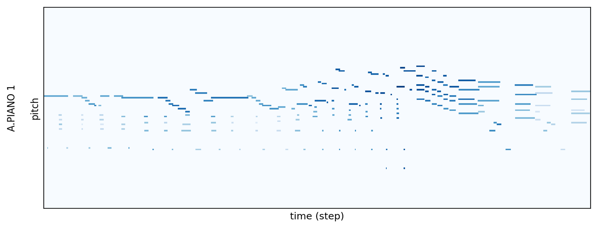
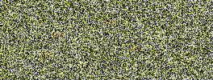
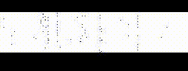
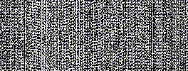
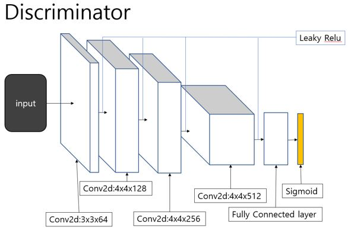
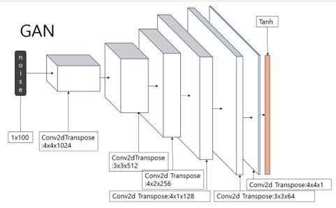
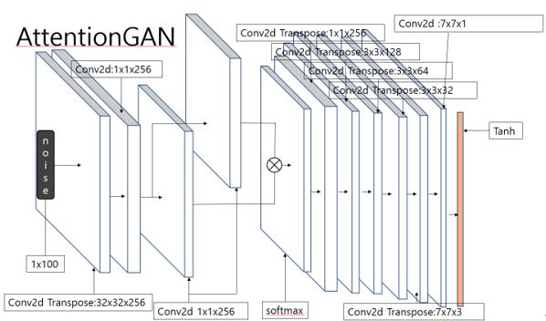
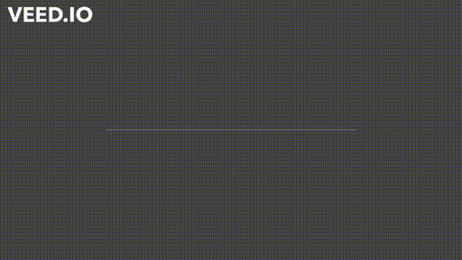

# MPI_SAGAN -  MIDI Piano Image Generative Adversarial Network using Self-Attention 
____

This project is the generating music using self attention gan.

Out result is <a href="https://github.com/Malgus1995/MPI_SAGAN#self-attention-gan-result" >here</a>.

Before training the model, we convert midi file to grayscale midi image.

 

 
piano roll midi file  

 
gray scale midi image  

### training the gan without thresh hold / training the gan applying 0.3 thresh / training the gan applying 0.5 thresh
    

## Models arthitecture
___

  

  

  

## Data source
___
<strong> GTZAN Dataset - Music Genre Classification</strong>  
Link : https://www.kaggle.com/andradaolteanu/gtzan-dataset-music-genre-classification  
<strong> Classical Music MIDI</strong>  
Link : https://www.kaggle.com/soumikrakshit/classical-music-midi  
<strong> Magenta Datasets </strong>  
Link : https://magenta.tensorflow.org/datasets/  
<strong> Music MIDI Collection</strong>  
Link : https://www.kaggle.com/programgeek01/anime-music-midi

## GAN Result
___

### The DC gan model which trained 450 epoch generate fake music
  
youtube link: https://youtu.be/HZKP8TjhIk8

### The DC gan model which trained 1000 epoch generate fake music
  
youtube link: https://youtu.be/apQXf4pcT2I

## Self attention GAN Result
___
### The self attention gan model which trained 150 epoch generate fake music
  
youtube link: https://youtu.be/QxlSpPadJnE

### The self attention gan model which trained 190 epoch generate fake music
  
youtube link: https://youtu.be/5XvYgP_0rw0

### The self attention gan model which trained 420 epoch generate fake music
  
youtube link: https://youtu.be/nfh7_8glCIM

### The self attention gan model which trained 430 epoch generate fake music
  
youtube link: https://youtu.be/dNytCDL6Ss4
___
